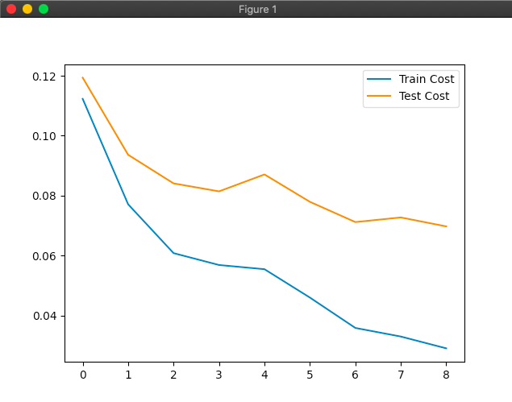

# MNIST Neural Network
This project aims to to build a simple neural network using the famous MNIST data set. It is a dataset of 60,000 28x28 grayscale images of the 10 digits, along with a test set of 10,000 images. We change its labels in this way: 
* Set numbers less than 5 to zero.
* Set numbers greater than 5 to one. 

We’ll train our neural network to recognize hand-written digits.

### Building on macOS

#### Requirements

Install the requirements via command:

	$ pip3 install -r requirements.txt

1. Clone the repository.
2. Change the directory to src.
3. Run  <code>$ python3 main.py</code> 
4. Now you can check the cost and accuracy of training and test sets!

### Training and test costs

